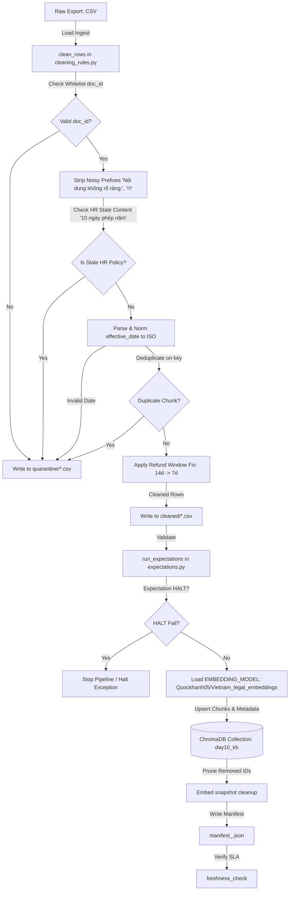

# Kiến trúc pipeline — Lab Day 10

**Nhóm:** AI In Action - Nhóm 5
**Cập nhật:** 2026-06-10

---

## 1. Sơ đồ luồng (Data Pipeline Flow)

---

## 2. Ranh giới trách nhiệm

| Thành phần | Input | Output | Owner nhóm |
|------------|-------|--------|--------------|
| **Ingest** | `data/raw/policy_export_dirty.csv` | List[Dict[str, str]] (Raw rows) | Ingestion Owner |
| **Transform** | Raw rows | Cleaned rows (List[Dict]) & Quarantine rows (List[Dict]) | Cleaning Owner |
| **Quality** | Cleaned rows | Expectation results (List[ExpectationResult]), Halt signal (boolean) | Quality Owner |
| **Embed** | Cleaned rows + `EMBEDDING_MODEL` env | Upserted ChromaDB Collection & Manifest metadata | Embed Owner |
| **Monitor** | Manifest JSON | Freshness SLA status (PASS/WARN/FAIL) | Monitoring Owner |

---

## 3. Idempotency & rerun

- **Idempotency Strategy:** Chúng tôi sử dụng cơ chế hash nội dung chunk ổn định thông qua hàm `_stable_chunk_id(doc_id, chunk_text, seq)` để sinh `chunk_id`. Khi chạy lại pipeline (rerun), ChromaDB sẽ thực hiện `col.upsert()` dựa trên `chunk_id` này.
- **Rerun 2 lần:** Nhờ cơ chế `upsert`, việc rerun nhiều lần hoàn toàn không làm phình dữ liệu hay tạo bản trùng lặp trong cơ sở dữ liệu vector.
- **Vector Prune:** Pipeline chủ động quét qua các `ids` hiện có trong collection và tự động xóa bỏ các ID cũ không còn nằm trong danh sách cleaned của phiên chạy hiện tại (`col.delete(ids=drop)`). Điều này ngăn chặn triệt để tình trạng "mồi cũ" làm nhiễu kết quả truy vấn.

---

## 4. Liên hệ Day 09

- Pipeline này đóng vai trò là tầng chuẩn bị dữ liệu (Data Ingestion & Observability Layer) cho các tác nhân AI (CS Agent & IT Helpdesk Agent) ở Day 09.
- Dữ liệu tri thức được lưu trữ tập trung vào collection `day10_kb` trong ChromaDB. Agent Day 09 có thể kết nối trực tiếp đến collection này để thực hiện Semantic Search, đảm bảo tri thức luôn sạch sẽ, không chứa các prefix rác hoặc tài liệu lỗi thời đã bị loại bỏ ở bước quarantine.

---

## 5. Rủi ro đã biết

- **Embedding Model Dependency:** Pipeline phụ thuộc vào việc tải xuống và lưu cache model `Quockhanh05/Vietnam_legal_embeddings` từ Hugging Face. Nếu mất kết nối mạng hoặc Hugging Face gặp sự cố, pipeline sẽ lỗi ở bước nhúng.
- **Data Schema Evolution:** Nếu cấu trúc file export thay đổi (thêm/bớt cột), hàm `clean_rows` có thể không ánh xạ đúng và đẩy toàn bộ dữ liệu vào quarantine.
- **Freshness SLA:** Dữ liệu mẫu chứa timestamp xuất bản cũ nên kiểm tra freshness sẽ luôn trả về `FAIL`. SLA cần được cấu hình linh hoạt hơn tùy môi trường production.
